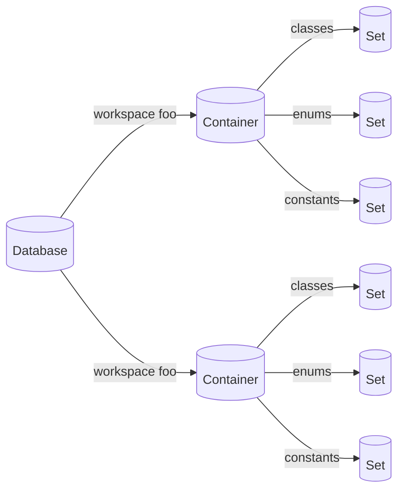

# LSP - Object storage

A storage structure that allows storage of objects, that are related to files/documents or other references, that an LSP (Language Server Protocol) might need to store/delete/update.

Objects in LSP used to summarize project information usually have an identification field and a reference field that stores where the object is stored. Based on folders/workspaces/projects, A developer might want to store objects in a structured way, so that they can be easily retrieved.

As well as when a file/folder is moved or deleted the objects that are related to it should be updated/deleted.

## Data structure

**Set**  
A set is a collection of objects, each object is a key-value pair, where the key is the identification of the object and the value is the object itself.
There can be multiple data items with the same Identification, but the reference should be unique. (something was defined twice in a project)

**Container**  
A container is a Collection of sets, each Set is storing a category of objects.
